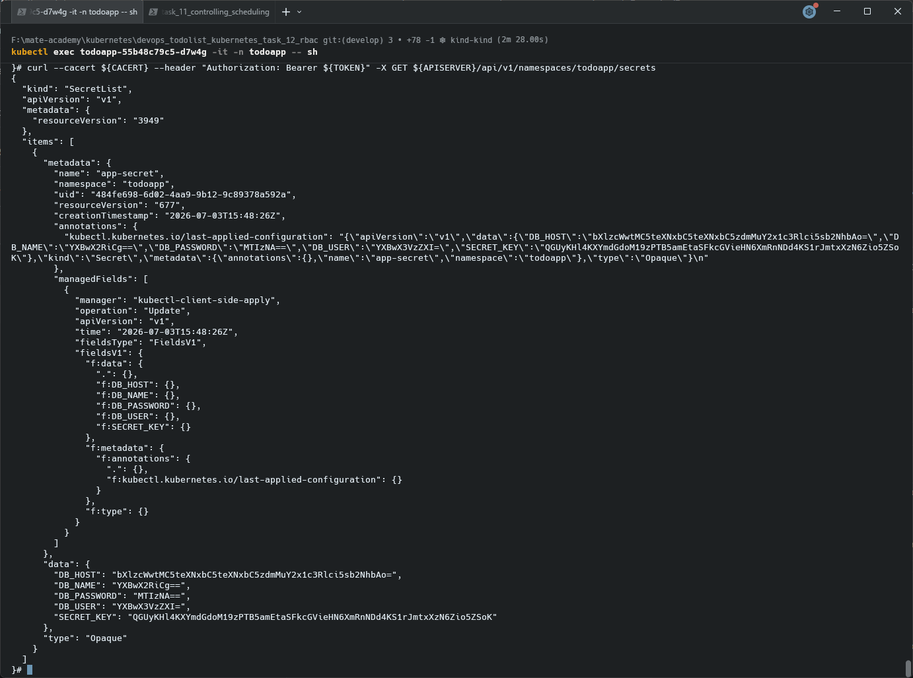

# RBAC Validation

### 1 ServiceAccount, Role, and RoleBinding exist
 
```bash
kubectl get serviceaccount secrets-reader -n todoapp
kubectl get role secrets-listener -n todoapp
kubectl get rolebinding secrets-listener-binding -n todoapp
```
 
**Expected:** All three resources are found (no `NotFound` errors).
 
### 2 RoleBinding correctly links the Role and ServiceAccount
 
```bash
kubectl describe rolebinding secrets-listener-binding -n todoapp
```
 
**Expected:** Output shows:
```
Role:
  Kind:  Role
  Name:  secrets-listener
Subjects:
  Kind            Name
  ----            ----
  ServiceAccount  secrets-reader
```
 
### 3 Deployment pods actually use the ServiceAccount
 
```bash
kubectl get pods -n todoapp -o jsonpath='{range .items[*]}{.metadata.name}{" -> "}{.spec.serviceAccountName}{"\n"}{end}'
```
 
**Expected:** Every todoapp pod shows `secrets-reader` as its service account.
 
### 4 Permission check — ServiceAccount can list secrets
 
```bash
kubectl auth can-i list secrets -n todoapp --as=system:serviceaccount:todoapp:secrets-reader
```
 
**Expected:** `yes`
 
### 5 Negative check — ServiceAccount has no broader access than granted
 
```bash
kubectl auth can-i delete secrets -n todoapp --as=system:serviceaccount:todoapp:secrets-reader
kubectl auth can-i list pods -n todoapp --as=system:serviceaccount:todoapp:secrets-reader
```
 
**Expected:** `no` for both — confirms the Role grants only `list` on `secrets`, not broader permissions (least-privilege check).
 
---

## Make a `curl` request to list secrets from the deployment Pod

```bash
kubectl exec <pod-name> -it -n mateapp -- sh
```

Define environment variables:

```bash
APISERVER=https://kubernetes.default.svc
SERVICEACCOUNT=/var/run/secrets/kubernetes.io/serviceaccount
TOKEN=$(cat ${SERVICEACCOUNT}/token)
CACERT=${SERVICEACCOUNT}/ca.crt
```

Make a request to list secrets:


```bash
curl --cacert ${CACERT} --header "Authorization: Bearer ${TOKEN}" -X GET ${APISERVER}/api/v1/namespaces/todoapp/secrets
```

An example of the responce:

